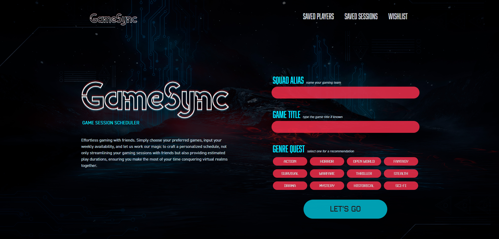
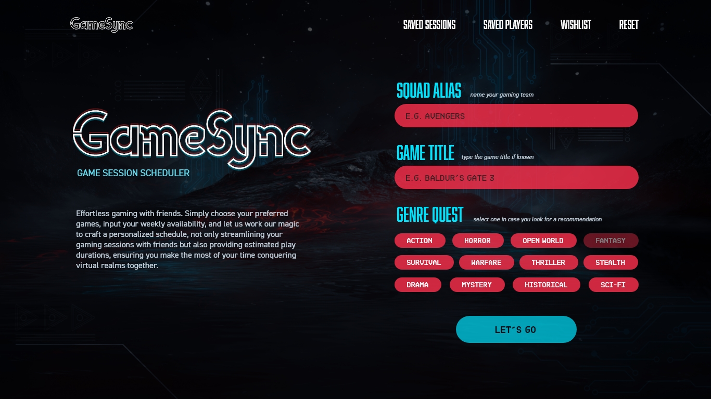
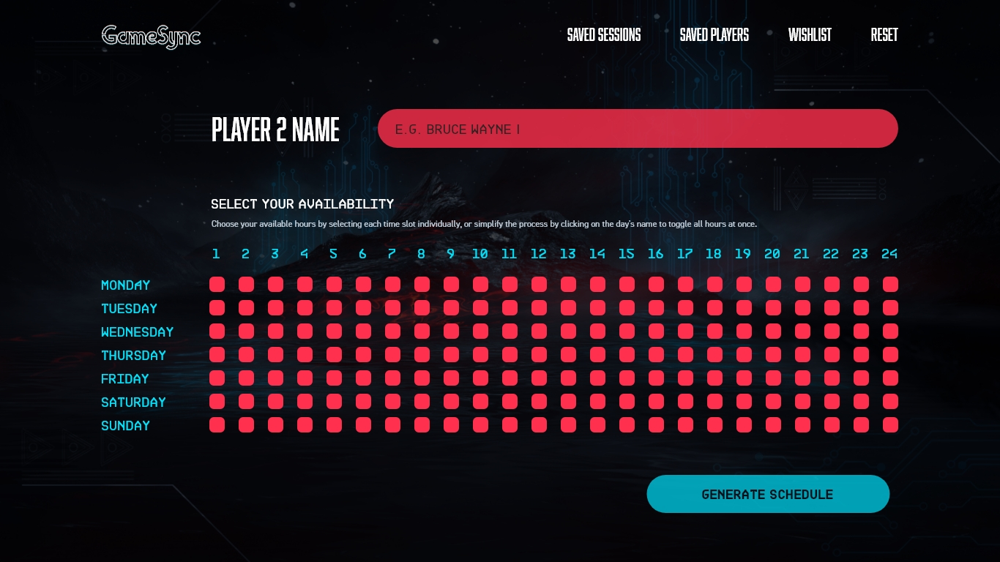
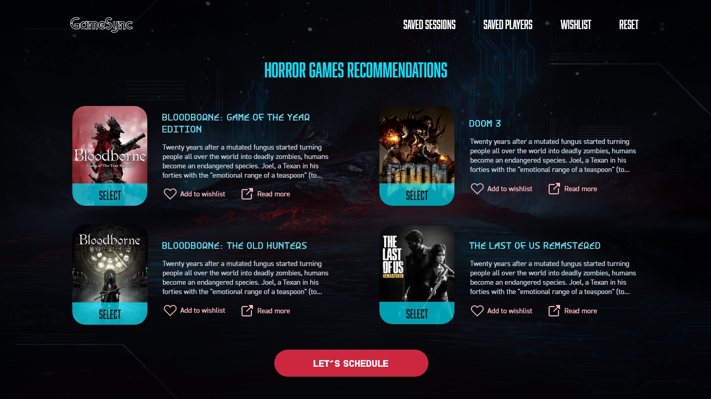
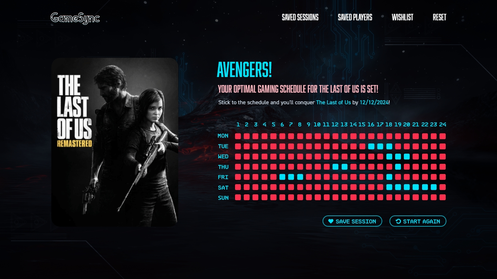

# 🎮 Game Sync. Game Session Scheduler

## Description 
This collaborative project aims to streamline the process of scheduling gaming sessions with friends by providing an intuitive solution. Leveraging data from the RAWG API, our team has worked together to create an efficient and user-friendly platform that simplifies the task of finding and scheduling gaming sessions, ensuring a seamless experience for gamers.



## Front End

- HTML
- CSS
- Javascript 
- React
- Tailwind


## Contributions
- [Leanne Goldsmith](https://github.com/LeanneCodes)
- [Aleks Rydzkowska](https://github.com/thevisualriot)
- [Kane Chang](https://github.com/kane-chang)
- [Alan Chumbley](https://github.com/Alan-Chumbley)

## Deployed Site
- Deployed site:
https://gamesync-game-session-scheduler.netlify.app/

## UI Design
The initial user interface design of our project reflects a modern and intuitive layout aimed at providing a seamless user experience. Our design philosophy centers around simplicity and clarity, ensuring users can effortlessly navigate through the application. The color palette combines vibrant accents with neutral tones to enhance visual appeal and maintain readability. We've meticulously crafted each component to align with the project's theme and purpose. Below are screenshots showcasing the primary design elements, giving you a glimpse into the thoughtful and user-friendly interface we've developed.









## Support 
For questions, issues, or collaboration opportunities, please visit our [GitHub repository](https://github.com/Alan-Chumbley/Gaming-scheduler) and feel free to reach out to contributors by creating a new issue or directly contacting them through the platform. 

## Future Contributions

To get started, run the below command to install dependencies.

```bash
npm i
```

## Resources
- [Navigate](https://simplefrontend.com/redirect-to-another-page-in-react/?utm_content=cmp-true)
- [Tailwind navbar](https://tailwindui.com/components/application-ui/navigation/navbars)
- [Tailwind modals](https://www.creative-tim.com/learning-lab/tailwind-starter-kit/documentation/react/modals/regular)
- [Object destructuring](https://medium.com/@gazzaazhari/destructuring-props-in-react-d8f163d3ef84)
- [Truncate text](https://www.freecodecamp.org/news/how-to-truncate-text-with-css-javascript/)
- [Flowbite modal](https://flowbite.com/docs/components/modal/)
- [Dropdowns in modals](https://tailwindui.com/components/application-ui/elements/dropdowns)
- [Hide API keys](https://medium.com/@pratyushsingha83/beginner-guide-to-setup-react-with-vite-and-tailwind-css-react-router-and-hiding-api-key-4156421dbef3#:~:text=now%20let's%20learn%20how%20to%20hide%20apikey%20on%20react%2Bvite%20projects.&text=Clone%20that%20repository%20and%20download,and%20start%20your%20development%20server.&text=Now%20go%20to%20VS%20code,key%20as%20an%20environment%20variable.)

